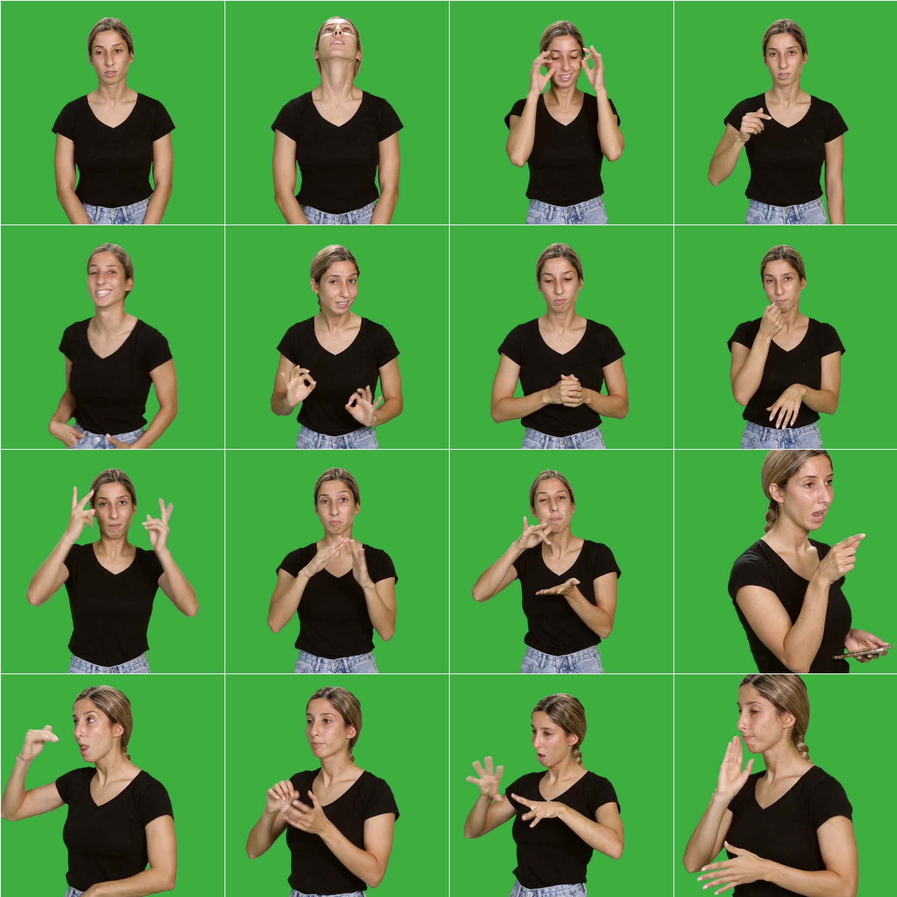

# StyleGAN3

This implementation uses the [StyleGAN3](https://github.com/NVlabs/stylegan3) architecture for video generation, in
multiple parts:

1. StyleGAN3 learns to generate individual images from latent space
2. Pose-to-latent mapping is learned using a simple linear LSTM model.

## Requirements

* High-end NVIDIA GPUs with at least 12 GB of memory
* Correctly installed
  the [NVIDIA container runtime](https://docs.docker.com/config/containers/resource_constraints/#gpu).

## Setup

### Docker

Build a docker image as follows:

```.bash
# Build the stylegan3:latest image
docker build --tag stylegan3 .
```

Running the following command will start a docker container with the current directory mounted to `/scratch` in the
container, and the current user's UID/GID set to the container's user. This will allow the container to write files to
the current directory without root permissions.

```.bash
docker run --gpus=all -it --rm --user $(id -u):$(id -g) --ipc=host \
    -v `pwd`:/scratch --workdir /scratch -e HOME=/scratch \
    -w /workspace/stylegan3 stylegan3 \
    /bin/bash
```

The `docker run` invocation may look daunting, so let's unpack its contents here:

- `--gpus all -it --rm --user $(id -u):$(id -g)`: with all GPUs enabled, run an interactive session with current user's
  UID/GID to avoid Docker writing files as root.
- ``-v `pwd`:/scratch --workdir /scratch``: mount current running dir (e.g., the top of this git repo on your host
  machine) to `/scratch` in the container and use that as the current working dir.
- `-e HOME=/scratch`: let PyTorch and StyleGAN3 code know where to cache temporary files such as pre-trained models and
  custom PyTorch extension build results. Note: if you want more fine-grained control, you can instead
  set `TORCH_EXTENSIONS_DIR` (for custom extensions build dir) and `DNNLIB_CACHE_DIR` (for pre-trained model download
  cache). You want these cache dirs to reside on persistent volumes so that their contents are retained across
  multiple `docker run` invocations.

### Data

Initially, the videos were centered on the midpoint of the shoulders and cropped to three times the width of the
shoulders. Upon evaluating the training runs, particularly
run [00013](training-runs/00013-stylegan3-r-sign-language-256x256-gpus4-batch32-gamma8), we noticed that the model was
successful in generating faces and bodies. We attribute this success to the consistent positioning of the face in the
cropped frames. However, we found that the model struggled to generate hands effectively. To address this issue, we
added hand-centered data to the dataset. Specifically, we added data from the `MIDDLE_FINGER_MCP` of either hand.



Follow the instructions in the "Data" section of the [pose_to_video/README.md](../README.md) file.

### Data Preparation

Then, to prepare the data, run:

```.bash
# Original 1024x1024 resolution.
python dataset_tool.py \
    --source=/scratch/frames1024.zip \
    --dest=/scratch/datasets/sign-language-1024x1024.zip

# Scaled down 512x512 resolution.
python dataset_tool.py \
    --source=/scratch/frames512.zip \
    --dest=/scratch/datasets/sign-language-512x512.zip \
    --resolution=512x512
    
# Scaled down 256x256 resolution.
python dataset_tool.py \
    --source=/scratch/frames256.zip \
    --dest=/scratch/datasets/sign-language-256x256.zip \
    --resolution=256x256
```

## Training

You can train new networks using `train.py`. For example:

```.bash
# Train StyleGAN3-R using 4 GPUs
python train.py --outdir=/scratch/training-runs --cfg=stylegan3-r --data=/scratch/datasets/sign-language-256x256.zip \
    --gpus=4 --batch=32 --gamma=8 --snap=5 --aug=noaug --cbase=16384 \
    --resume=https://api.ngc.nvidia.com/v2/models/nvidia/research/stylegan3/versions/1/files/stylegan3-r-ffhqu-256x256.pkl

python train.py --outdir=/scratch/training-runs --cfg=stylegan3-r --data=/scratch/datasets/sign-language-256x256.zip \
    --gpus=4 --batch=32 --gamma=8 --snap=5 --aug=noaug --cbase=16384 \
    --resume=/scratch/training-runs/00037-stylegan3-r-sign-language-256x256-gpus4-batch32-gamma8/network-snapshot-005740.pkl
```

Note that the result quality and training time depend heavily on the exact set of options. The most important
ones (`--gpus`, `--batch`, and `--gamma`) must be specified explicitly, and they should be selected with care.
See [`python train.py --help`](https://github.com/NVlabs/stylegan3/docs/train-help.txt) for the full list of options
and [Training configurations](https://github.com/NVlabs/stylegan3/docs/configs.md) for general guidelines &amp;
recommendations, along with the expected training speed &amp; memory usage in different scenarios.

The results of each training run are saved to a newly created directory, for
example `~/training-runs/00000-stylegan3-t-afhqv2-512x512-gpus8-batch32-gamma8.2`. The training loop exports network
pickles (`network-snapshot-<KIMG>.pkl`) and random image grids (`fakes<KIMG>.png`) at regular intervals (controlled
by `--snap`). For each exported pickle, it evaluates FID (controlled by `--metrics`) and logs the result
in `metric-fid50k_full.jsonl`. It also records various statistics in `training_stats.jsonl`, as well as `*.tfevents` if
TensorBoard is installed.

## Generate grid of videos

```.bash
python gen_video.py --output=/scratch/training-runs/lerp2.mp4 --trunc=1 --seeds=0-31 --grid=4x2 \
    --network=/scratch/training-runs/00037-stylegan3-r-sign-language-256x256-gpus4-batch32-gamma8/network-snapshot-005740.pkl
```

Output of unconstrained generation:

<video src="figures/gen_example.mp4" width="100%" controls></video>

## Generate videos

```.bash
cd /workspace/stylegan3

# Generate latent codes
python /scratch/src/generate_latent_codes.py --animations-directory=/scratch/animations \
    --network=/scratch/training-runs/00037-stylegan3-r-sign-language-256x256-gpus4-batch32-gamma8/network-snapshot-005740.pkl

# Generate animations
python /scratch/src/render_animations.py --animations-directory=/scratch/animations \
    --network=/scratch/training-runs/00037-stylegan3-r-sign-language-256x256-gpus4-batch32-gamma8/network-snapshot-005740.pkl
   
# Extract poses, from the main directory, run:
python -m video_to_pose.directory --directory=pose_to_video/stylegan3/animations
```
