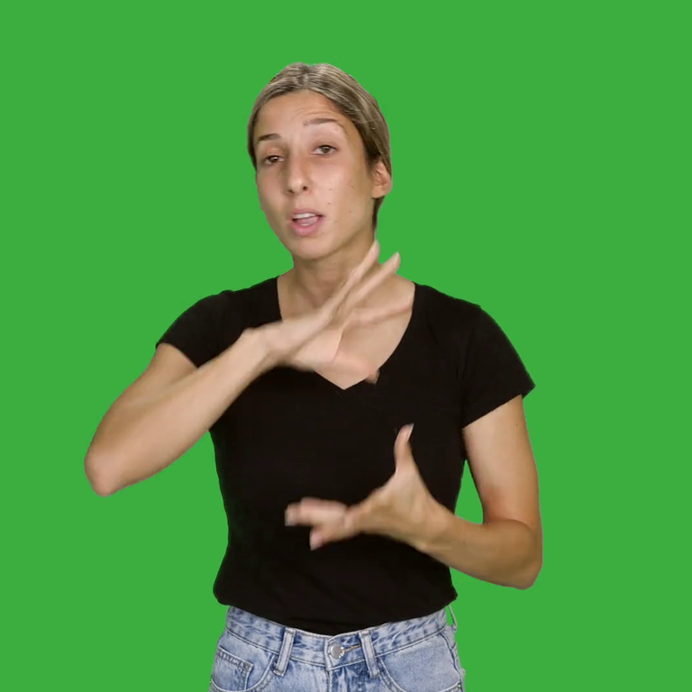
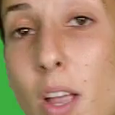

## Simple Upscaler

This directory contains code for training a model to upscale 256x256 images to 768x768 images.

It relies on data processed by [../data/BIU-MG](../data/BIU-MG), at 768x768 resolution.

| Original                                          | Nearest-neighbor | Bicubic | Lanczos | Proposed Model |
|---------------------------------------------------|------------------|---------|---------|----------------|
|                  |  |  |  |  |
|  |  |  |  |  |

## Building the Docker Image
```bash
docker build -t upscaler - < Dockerfile
```

## Training

And run it, mounting the relevant directories:

```bash
wandb docker-run --gpus "device=2" -it --rm --user $(id -u):$(id -g)  \
	--mount type=bind,source="$(pwd)",target=/upscaler \
	--mount type=bind,source="$(pwd)/training",target=/training \
	-w /upscaler upscaler \
	python -m src.train --data-path=frames768.zip
```

This will train for a while, and log each epoch result in a `training/progress` directory. Once satisfied with the
result, the script can be killed.

## Convert to TFJS

```.bash
pip install tensorflowjs
chmod +x keras_to_tfjs.sh
./keras_to_tfjs.sh
```

